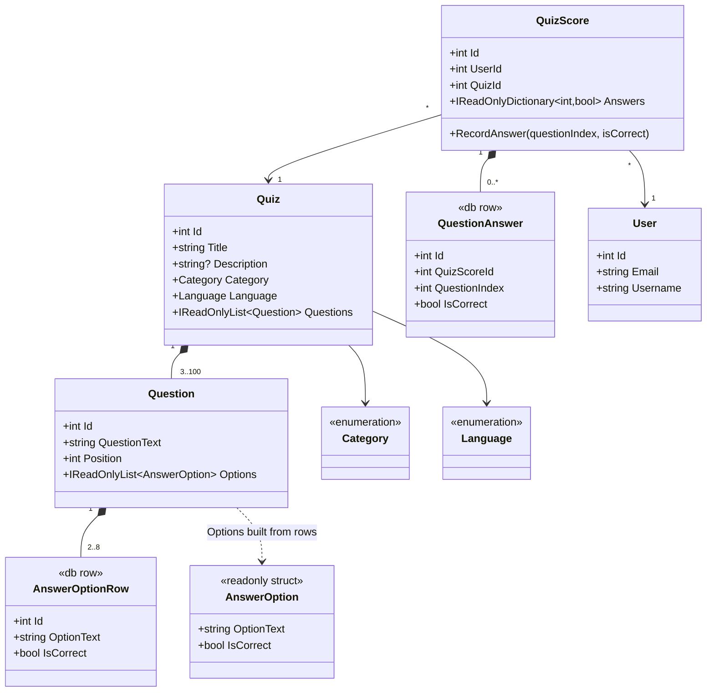

<!-- Made with AI> -->

# Quiz class diagram

`AnswerOptionRow` and `QuestionAnswer` are database rows. EF Core cannot store a struct collection or a dictionary directly, so `Question.Options` and `QuizScore.Answers` are built from these rows.